# [📈 Live Status](https://demo.upptime.js.org): <!--live status--> **🟧 Partial outage**

This repository contains the open-source uptime monitor and status page for [Fern](https://fern.wtf), powered by [Upptime](https://github.com/upptime/upptime).

With [Upptime](https://upptime.js.org), you can get your own unlimited and free uptime monitor and status page, powered entirely by a GitHub repository. We use [Issues](https://github.com/Kelvinouo/RobloxStats/issues) as incident reports, [Actions](https://github.com/Kelvinouo/RobloxStats/actions) as uptime monitors, and [Pages](https://demo.upptime.js.org) for the status page.

<!--start: status pages-->
<!-- This summary is generated by Upptime (https://github.com/upptime/upptime) -->
<!-- Do not edit this manually, your changes will be overwritten -->
<!-- prettier-ignore -->
| URL | Status | History | Response Time | Uptime |
| --- | ------ | ------- | ------------- | ------ |
|  [Roblox Site (Under Aritifical Testing)](https://www.roblox.com) | 🟩 Up | [roblox-site-under-aritifical-testing.yml](https://github.com/Kelvinouo/RobloxStats/commits/HEAD/history/roblox-site-under-aritifical-testing.yml) | 

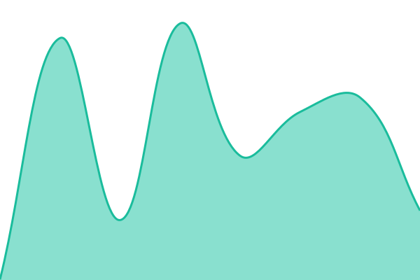 274ms
     
 | 

<a href="https://Kelvinouo.github.io/RobloxStats/history/roblox-site-under-aritifical-testing">100.00%</a>
    

|  [Roblox Devforum](https://devforum.roblox.com) | 🟩 Up | [roblox-devforum.yml](https://github.com/Kelvinouo/RobloxStats/commits/HEAD/history/roblox-devforum.yml) | 

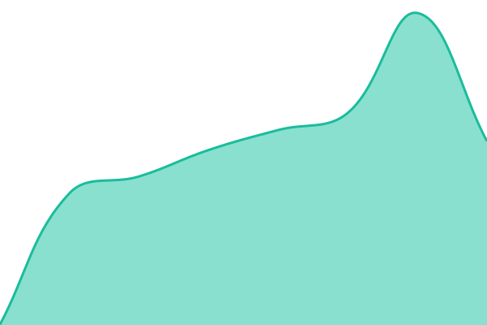 453ms
     
 | 

<a href="https://Kelvinouo.github.io/RobloxStats/history/roblox-devforum">100.00%</a>
    

|  [Roblox Devhub](https://developer.roblox.com) | 🟩 Up | [roblox-devhub.yml](https://github.com/Kelvinouo/RobloxStats/commits/HEAD/history/roblox-devhub.yml) | 

 266ms
     
 | 

<a href="https://Kelvinouo.github.io/RobloxStats/history/roblox-devhub">100.00%</a>
    

|  [Account Information API](https://accountinformation.roblox.com//) | 🟥 Down | [account-information-api.yml](https://github.com/Kelvinouo/RobloxStats/commits/HEAD/history/account-information-api.yml) | 

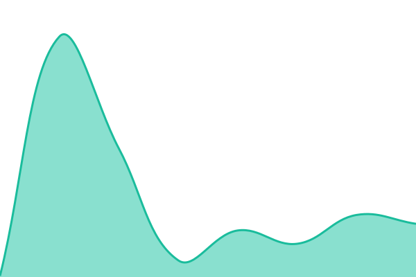 127ms
     
 | 

<a href="https://Kelvinouo.github.io/RobloxStats/history/account-information-api">0.00%</a>
    

|  [Account Settings API](https://accountsettings.roblox.com//) | 🟩 Up | [account-settings-api.yml](https://github.com/Kelvinouo/RobloxStats/commits/HEAD/history/account-settings-api.yml) | 

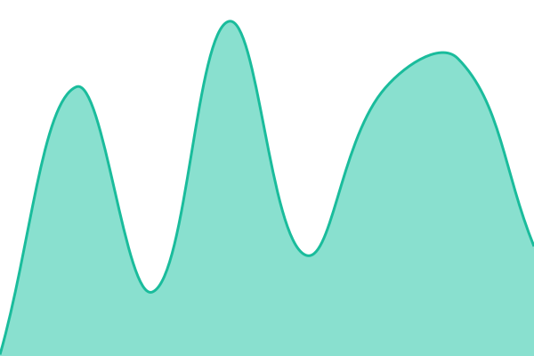 222ms
     
 | 

<a href="https://Kelvinouo.github.io/RobloxStats/history/account-settings-api">100.00%</a>
    

|  [Asset Delivery](https://assetdelivery.roblox.com//) | 🟥 Down | [asset-delivery.yml](https://github.com/Kelvinouo/RobloxStats/commits/HEAD/history/asset-delivery.yml) | 

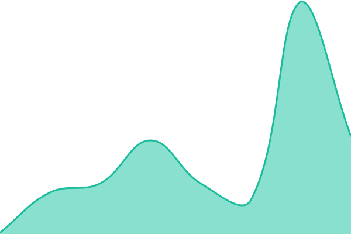 87ms
     
 | 

<a href="https://Kelvinouo.github.io/RobloxStats/history/asset-delivery">0.00%</a>
    

|  [Avatar API Endpoint](https://avatar.roblox.com/v1/avatar-rules) | 🟩 Up | [avatar-api-endpoint.yml](https://github.com/Kelvinouo/RobloxStats/commits/HEAD/history/avatar-api-endpoint.yml) | 

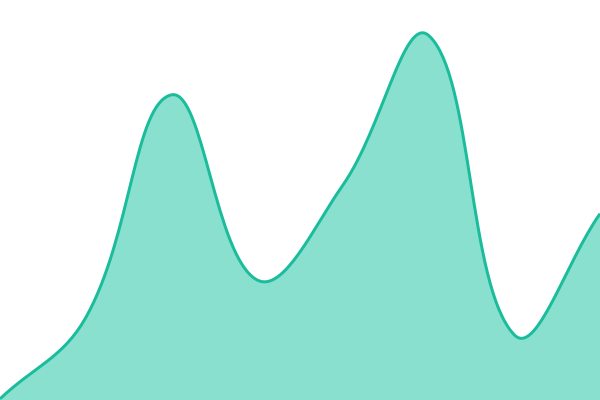 172ms
     
 | 

<a href="https://Kelvinouo.github.io/RobloxStats/history/avatar-api-endpoint">100.00%</a>
    

|  [Auth API Endpoint](https://auth.roblox.com//) | 🟥 Down | [auth-api-endpoint.yml](https://github.com/Kelvinouo/RobloxStats/commits/HEAD/history/auth-api-endpoint.yml) | 

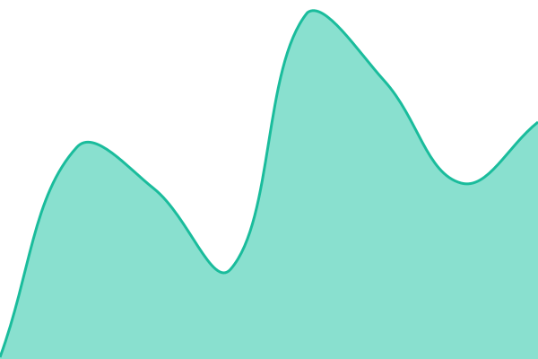 92ms
     
 | 

<a href="https://Kelvinouo.github.io/RobloxStats/history/auth-api-endpoint">0.00%</a>
    

|  [Badges API Endpoint](https://badges.roblox.com/v1/badges/2154057315) | 🟩 Up | [badges-api-endpoint.yml](https://github.com/Kelvinouo/RobloxStats/commits/HEAD/history/badges-api-endpoint.yml) | 

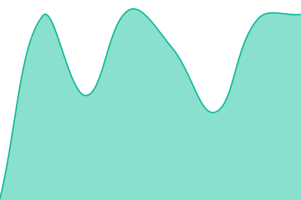 217ms
     
 | 

<a href="https://Kelvinouo.github.io/RobloxStats/history/badges-api-endpoint">100.00%</a>
    

|  [Billing API Endpoint](https://billing.roblox.com//) | 🟥 Down | [billing-api-endpoint.yml](https://github.com/Kelvinouo/RobloxStats/commits/HEAD/history/billing-api-endpoint.yml) | 

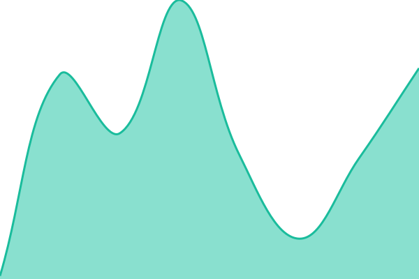 77ms
     
 | 

<a href="https://Kelvinouo.github.io/RobloxStats/history/billing-api-endpoint">0.00%</a>
    

|  [Account Settings Ui](https://apis.roblox.com/universal-app-configuration/v1/behaviors/account-settings-ui/content) | 🟩 Up | [account-settings-ui.yml](https://github.com/Kelvinouo/RobloxStats/commits/HEAD/history/account-settings-ui.yml) | 

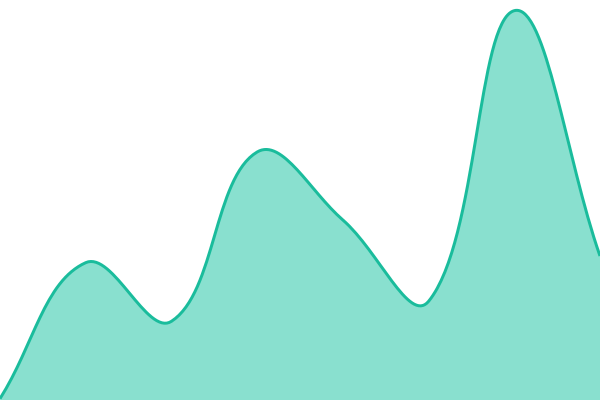 193ms
     
 | 

<a href="https://Kelvinouo.github.io/RobloxStats/history/account-settings-ui">100.00%</a>
    

|  [Catalog API Endpoint](https://catalog.roblox.com/v1/bundles/details?bundleIds=192) | 🟩 Up | [catalog-api-endpoint.yml](https://github.com/Kelvinouo/RobloxStats/commits/HEAD/history/catalog-api-endpoint.yml) | 

 274ms
     
 | 

<a href="https://Kelvinouo.github.io/RobloxStats/history/catalog-api-endpoint">100.00%</a>
    

|  [Datastore API Endpoint](https://gamepersistence.roblox.com//) | 🟥 Down | [datastore-api-endpoint.yml](https://github.com/Kelvinouo/RobloxStats/commits/HEAD/history/datastore-api-endpoint.yml) | 

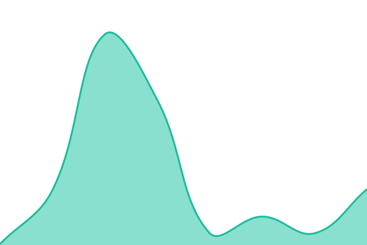 99ms
     
 | 

<a href="https://Kelvinouo.github.io/RobloxStats/history/datastore-api-endpoint">0.00%</a>
    

|  [Develop API Endpoint](https://develop.roblox.com/v2/places/17625359962) | 🟩 Up | [develop-api-endpoint.yml](https://github.com/Kelvinouo/RobloxStats/commits/HEAD/history/develop-api-endpoint.yml) | 

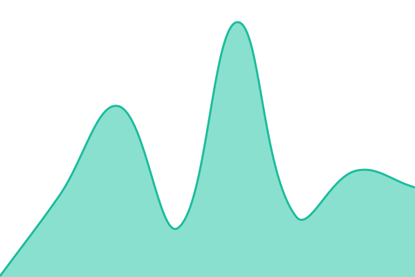 228ms
     
 | 

<a href="https://Kelvinouo.github.io/RobloxStats/history/develop-api-endpoint">100.00%</a>
    

|  [Economy API Endpoint](https://economy.roblox.com//) | 🟥 Down | [economy-api-endpoint.yml](https://github.com/Kelvinouo/RobloxStats/commits/HEAD/history/economy-api-endpoint.yml) | 

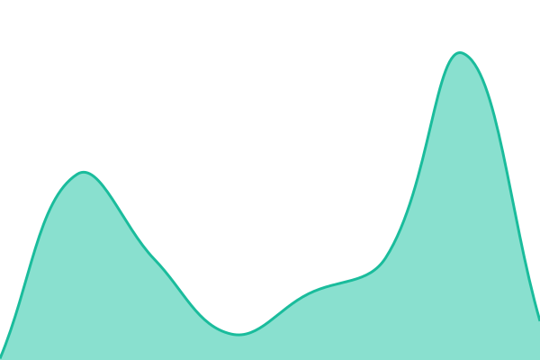 109ms
     
 | 

<a href="https://Kelvinouo.github.io/RobloxStats/history/economy-api-endpoint">0.00%</a>
    

|  [Friends API Endpoint](https://friends.roblox.com/v1/metadata) | 🟩 Up | [friends-api-endpoint.yml](https://github.com/Kelvinouo/RobloxStats/commits/HEAD/history/friends-api-endpoint.yml) | 

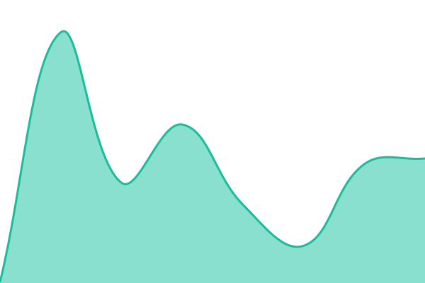 235ms
     
 | 

<a href="https://Kelvinouo.github.io/RobloxStats/history/friends-api-endpoint">100.00%</a>
    

|  [Game Join API Endpoint](http://gamejoin.roblox.com//) | 🟥 Down | [game-join-api-endpoint.yml](https://github.com/Kelvinouo/RobloxStats/commits/HEAD/history/game-join-api-endpoint.yml) | 

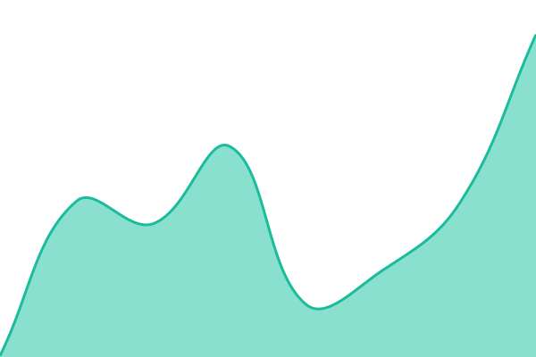 163ms
     
 | 

<a href="https://Kelvinouo.github.io/RobloxStats/history/game-join-api-endpoint">0.00%</a>
    

|  [Games API Endpoint](https://games.roblox.com//) | 🟥 Down | [games-api-endpoint.yml](https://github.com/Kelvinouo/RobloxStats/commits/HEAD/history/games-api-endpoint.yml) | 

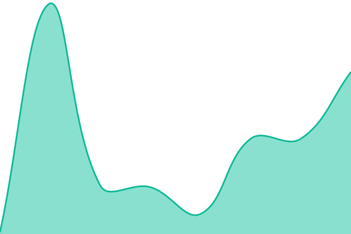 79ms
     
 | 

<a href="https://Kelvinouo.github.io/RobloxStats/history/games-api-endpoint">0.00%</a>
    

|  [Groups API Endpoint](https://groups.roblox.com/v1/groups/6594438) | 🟩 Up | [groups-api-endpoint.yml](https://github.com/Kelvinouo/RobloxStats/commits/HEAD/history/groups-api-endpoint.yml) | 

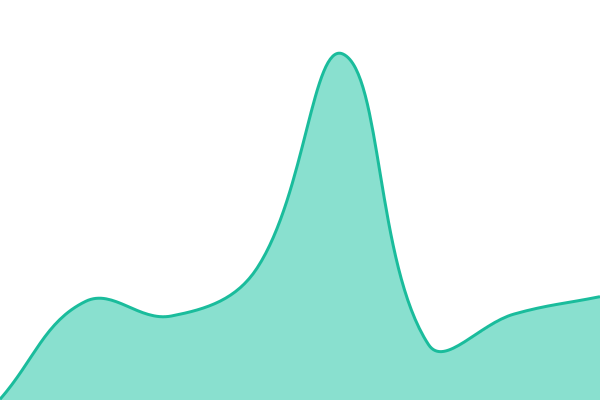 329ms
     
 | 

<a href="https://Kelvinouo.github.io/RobloxStats/history/groups-api-endpoint">100.00%</a>
    

|  [Inventory API Endpoint](https://inventory.roblox.com/v1/users/1427869852/assets/collectibles?limit=10&sortOrder=Asc) | 🟩 Up | [inventory-api-endpoint.yml](https://github.com/Kelvinouo/RobloxStats/commits/HEAD/history/inventory-api-endpoint.yml) | 

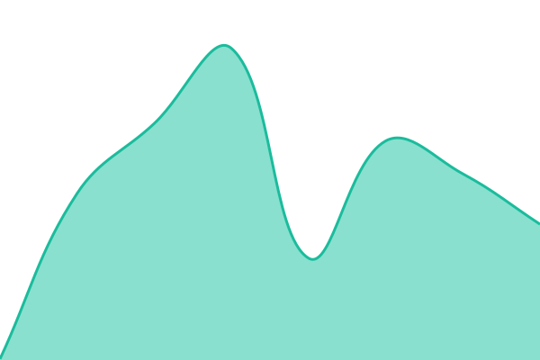 260ms
     
 | 

<a href="https://Kelvinouo.github.io/RobloxStats/history/inventory-api-endpoint">100.00%</a>
    

|  [Thumbnails API Endpoint](https://thumbnails.roblox.com/v1/assets?assetIds=1427869852&format=Png&isCircular=false&size=30x30) | 🟩 Up | [thumbnails-api-endpoint.yml](https://github.com/Kelvinouo/RobloxStats/commits/HEAD/history/thumbnails-api-endpoint.yml) | 

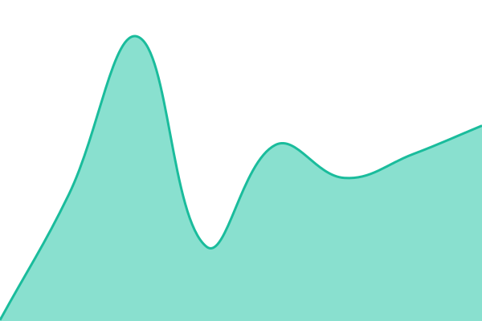 215ms
     
 | 

<a href="https://Kelvinouo.github.io/RobloxStats/history/thumbnails-api-endpoint">100.00%</a>
    

|  [Users API Endpoint](https://users.roblox.com//) | 🟩 Up | [users-api-endpoint.yml](https://github.com/Kelvinouo/RobloxStats/commits/HEAD/history/users-api-endpoint.yml) | 

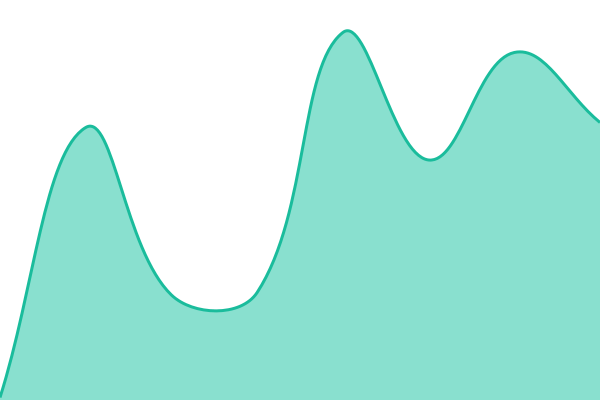 225ms
     
 | 

<a href="https://Kelvinouo.github.io/RobloxStats/history/users-api-endpoint">100.00%</a>
    

<!--end: status pages-->

[**Visit our status website →**](https://demo.upptime.js.org)

## 📄 License

- Powered by: [Upptime](https://github.com/upptime/upptime)
- Code: [MIT](./LICENSE) © [Anand Chowdhary](https://anandchowdhary.com), supported by [Pabio](https://pabio.com)
- Data in the `./history` directory: [Open Database License](https://opendatacommons.org/licenses/odbl/1-0/)
